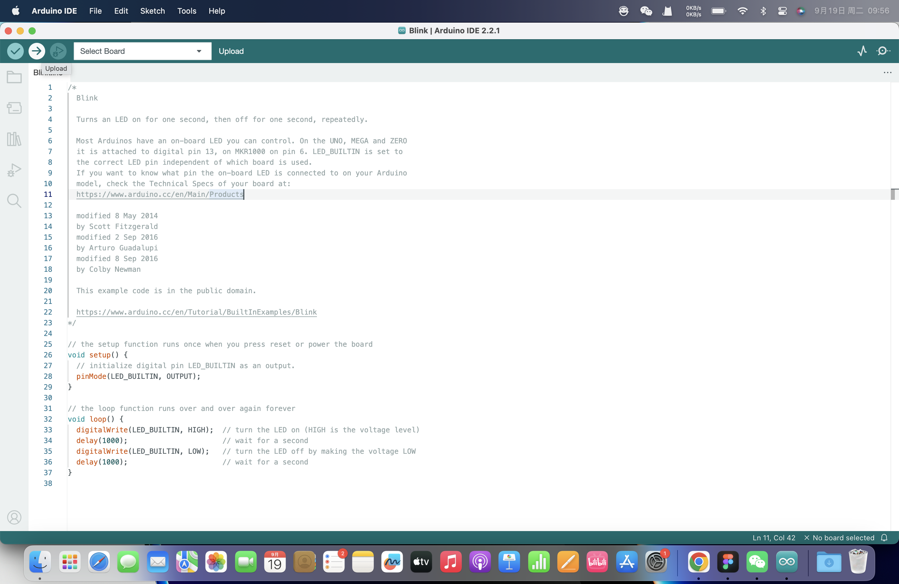

# Arduino on a breadboard

## Assignment's Description
Using an ATMega328 microcontroller and a set of low-level electronic components to assemble an “Arduino on a breadboard”. Describe the functions of each component and use USB-Serial Communication to upload test codes to the circuit from a computer.

## Components
Components used to assemble my own Arduino.

* Resistor
* Ceramic capacitor (tiny one)
* Electrolytic capacitor (big black one)
* LED diode
* Voltage Regulator (Transistor)
* Crystal Oscillator
* Microcontroller (ATMega328p)
* Pin Headers and Jumper Wires

## Assemble
[Building an Arduino on a Breadboard](https://www.https://www.example.com/)

## Arduino Coding
1.Using example codes in Arduino

2.Select Port

3.Select Board

4.Uploat

5.verify

