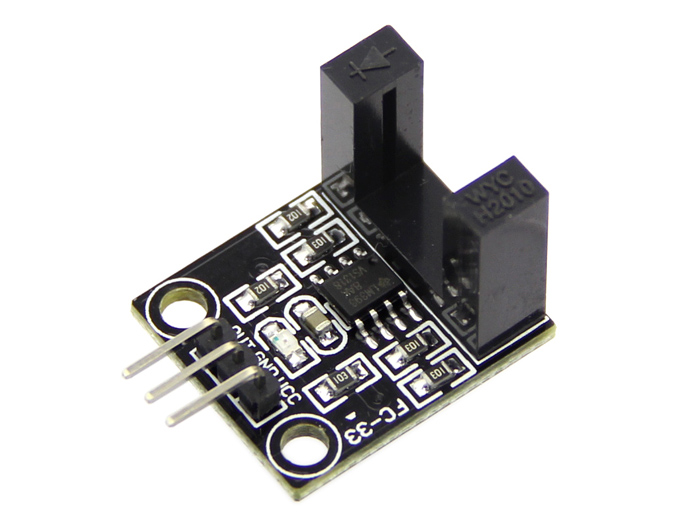
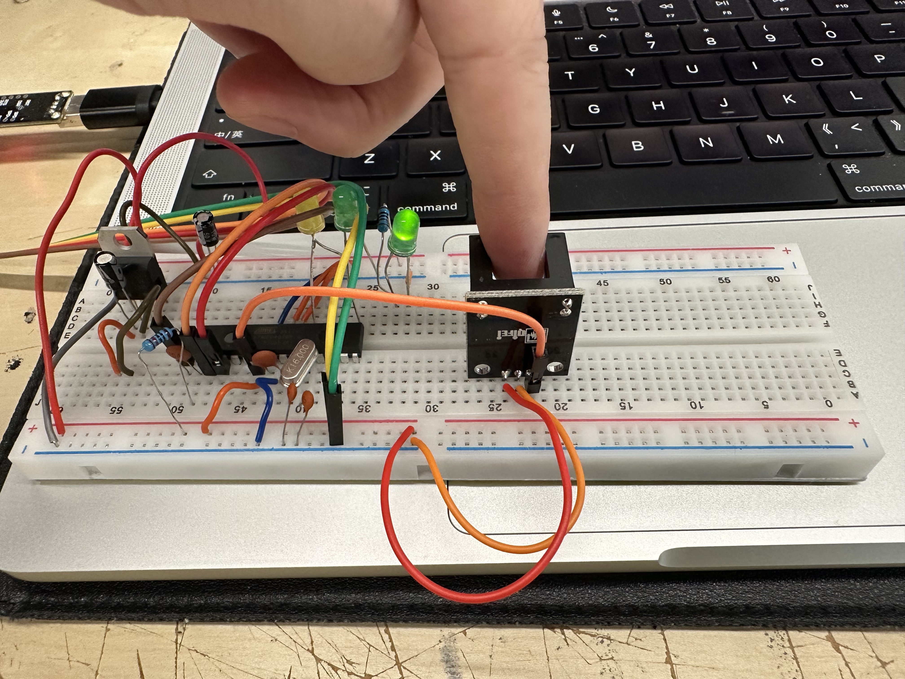
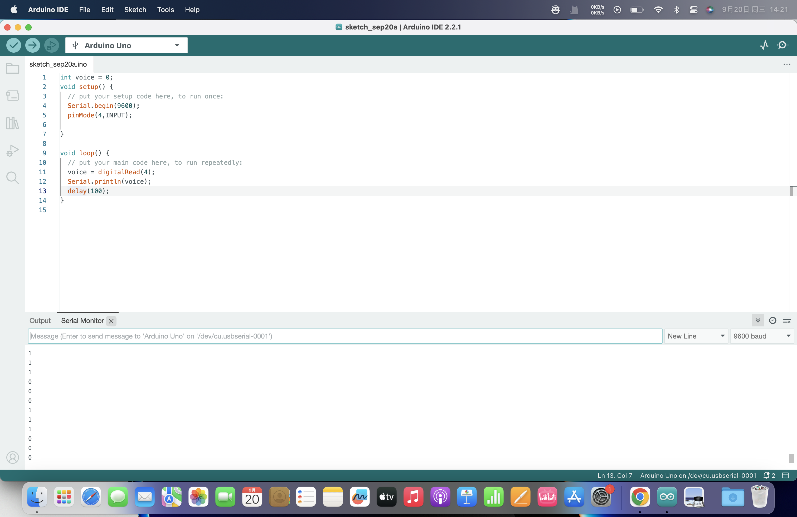
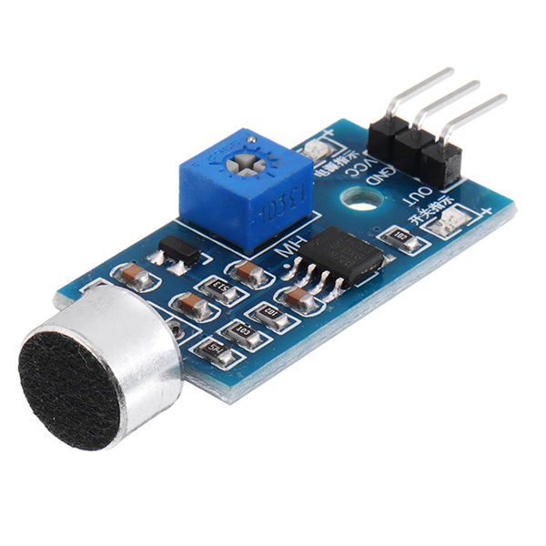
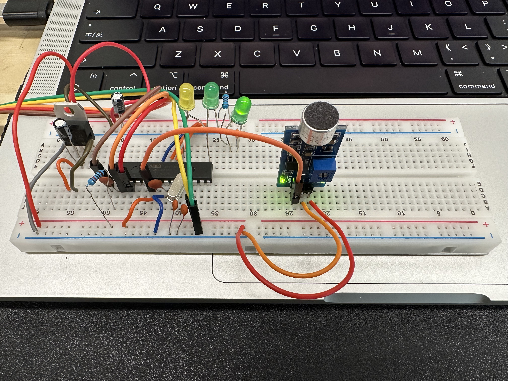
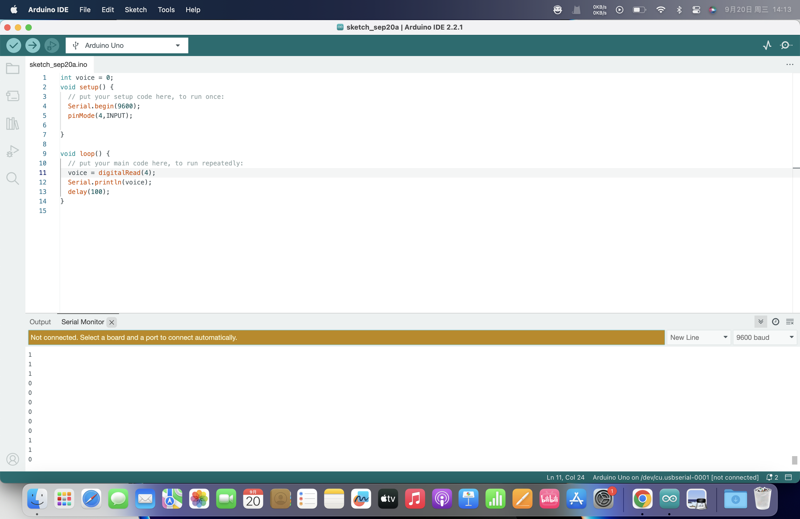
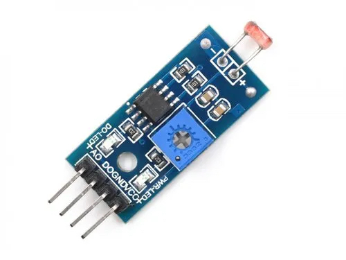
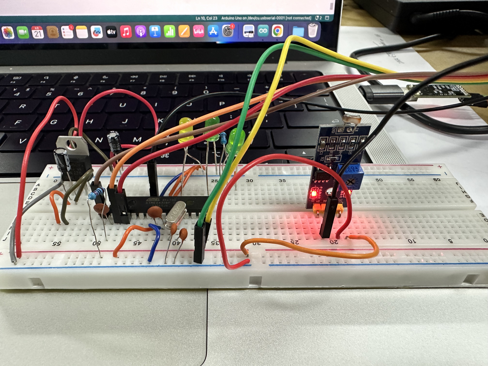
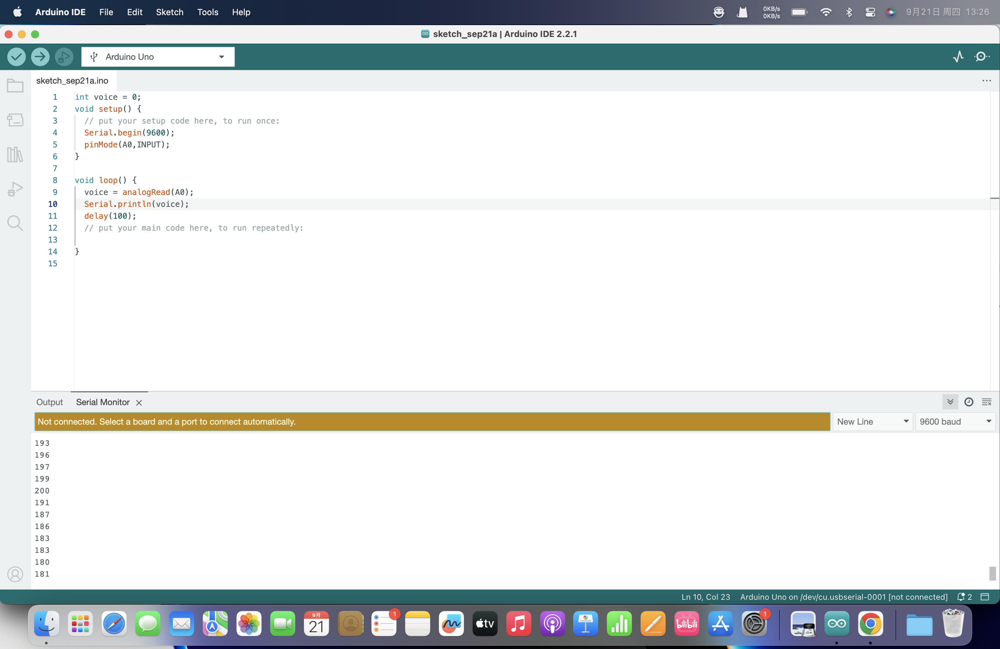

# Try Sensors

## Digital Signal
### Motor Speed Sensor

### Sound Microphone Sensor
Used as sound controled button and output 0/1 digital signals.

## Analog Signal
Output both digital signals and analog signals.

