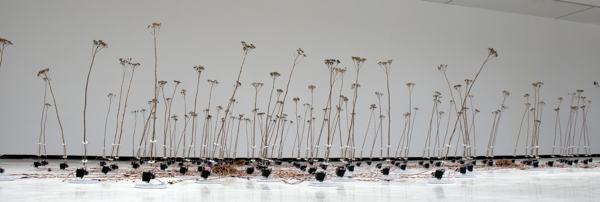

# Nature Exploration Record

## The Smell of Nature

Compared with other types of sense, the smell has more subtle but special affect on humans in nature. A variety of unique smells can be generated during the interaction of various elements in nature. Every time we sense the same smell in nature, there will be some unforgettable memory and wonderful feeling. The most common example is the smell of soil after raining, it's a mixed smell of soil, rainwater, grasses, fresh air and so forth. One specific smell can represent one specific season, weather, scene, experience and so on and the function of smell is endless.

But at the same time, smell is the most difficult sense to record and recall and it's more like an encounter when we are interacting with nature. So if we can better understand and make use of smell, we can better understand nature.

## The Patterns and Textures of Nature

Everything in nature has its own unique patterns and textures, just like leaves, trunk, mountain, snow and so forth. These patterns and textures of nature has high aesthetic value. When we delve deep into them, we could find that they can represent the changes of nature and the traces of time. With the interaction of different elements of nature, just like the sun shining on the surface and raindrops falling on the leaves, these patterns and textures could present different beauty in different environment. 

## The Rhythm of Nature
### Art Installation Case: TELE-PRESENT WIND

[Project website and relevant video](https://www.dwbowen.com/telepresent-wind)

This is an art installation using mechanical structure to simulate the rhythm of natural wind. It can visualize the rhythm of the wind and help people have a better understanding of it.
