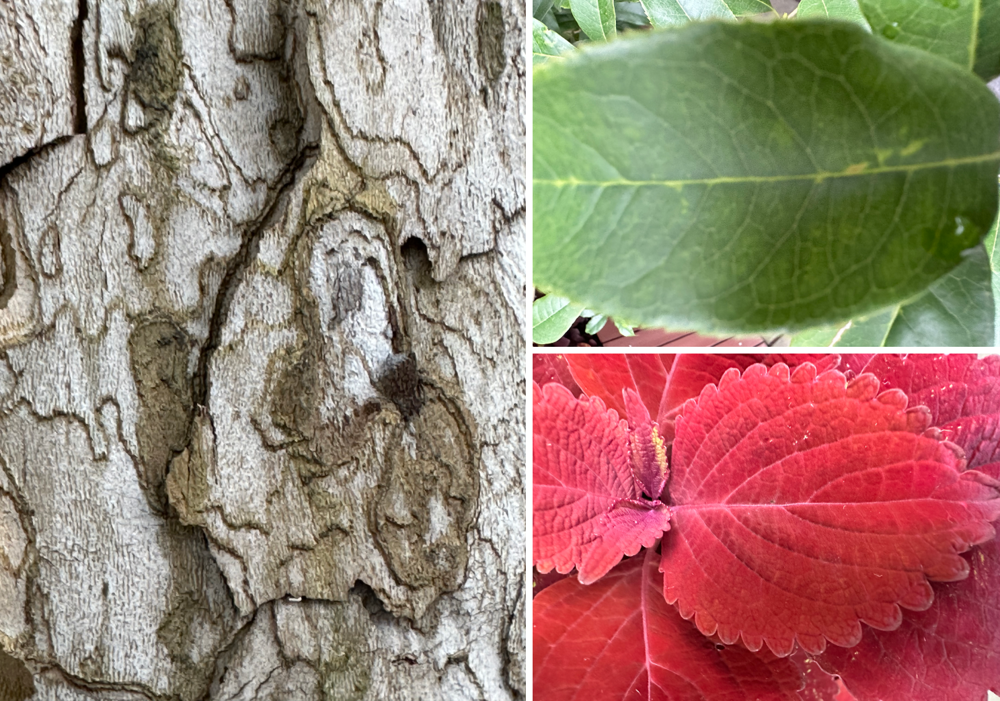

# Nature Exploration Record

## the smell of nature

Compared with other types of sense, the smell has more subtle but special affect on humans in nature. A variety of unique smells can be generated during the interaction of various elements in nature. Every time we sense the same smell in nature, there will be some unforgettable memory and wonderful feeling. The most common example is the smell of soil after raining, it's a mixed smell of soil, rainwater, grasses, fresh air and so forth. One specific smell can represent one specific season, weather, scene, experience and so on and the function of smell is endless.

But at the same time, smell is the most difficult sense to record and recall and it's more like an encounter when we are interacting with nature. So if we can better understand and make use of smell, we can better understand nature.

## the pattern and texture of nature

