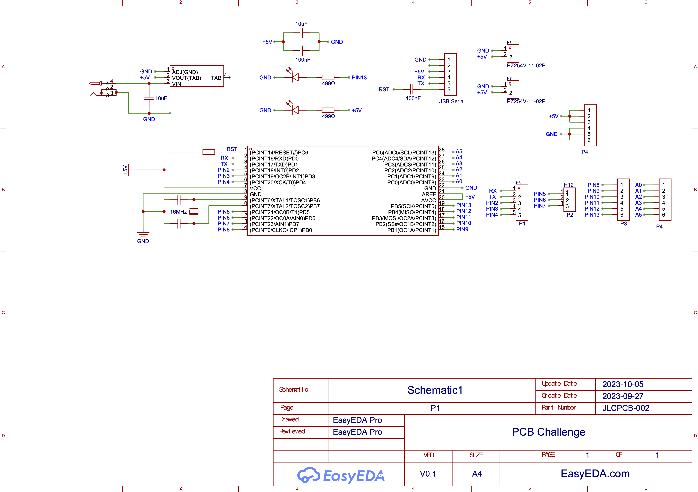
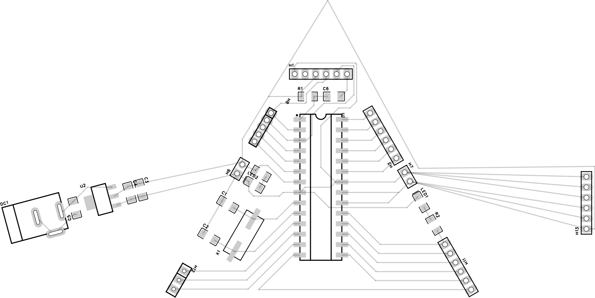
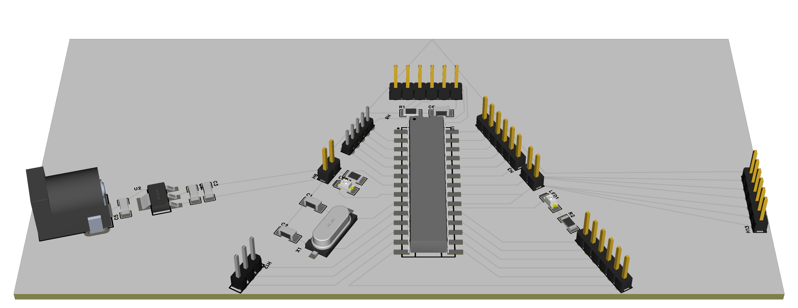

# Dispersion Board

## PCB Design

### Reference Image

My idea is come from the cover of one of the greatest album of all time called "the Dark Side of the Moon", whcih was created by legendary band Pink Floyd in 1973. This year happens to be the 50th anniversary of the launch of this album, so I choose it as my reference image. The name of this album comes from a astronomical phenomena that what we see is always the same side of the moon and the other dark side of the moon could never been seen by us in the earth. The main content of this album cover i a beam of light passes through the prism to produce dispersion. So I want to use my own pcb to imitate it.

### Schematic

### PCB 2D

### PCB 3D

