# Dispersion Board

## PCB Design

All of these design is finished with the help of [EasyEDA](https://pro.easyeda.com/editor).

### Reference Image

My idea is come from the cover of one of the greatest album of all time called "the Dark Side of the Moon", whcih was created by legendary band Pink Floyd in 1973. This year happens to be the 50th anniversary of the launch of this album, so I choose it as my reference image. The name of this album comes from an astronomical phenomena that what we see is always the same side of the moon and the other dark side of the moon could never been seen on earth. The main meaning of this album cover is a beam of light passes through the prism to produce dispersion. So I want to use my own pcb to imitate this dispersion process.

### Schematic

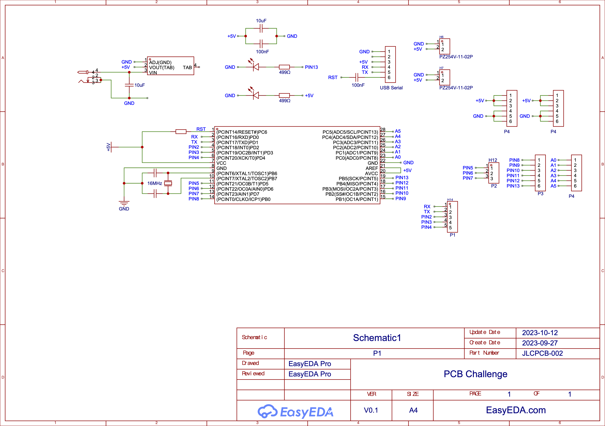

### PCB 2D

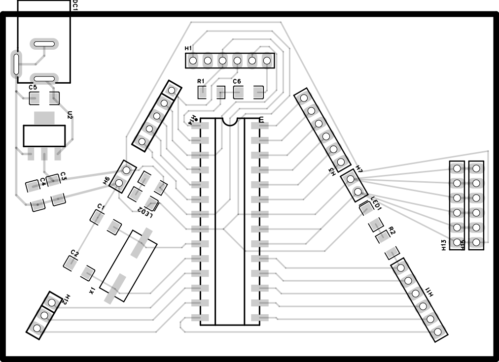

## PCB Fabrication

### Cutting Rules

Use the suitable cutting rules according to the capability of Fablab's CNC machine.

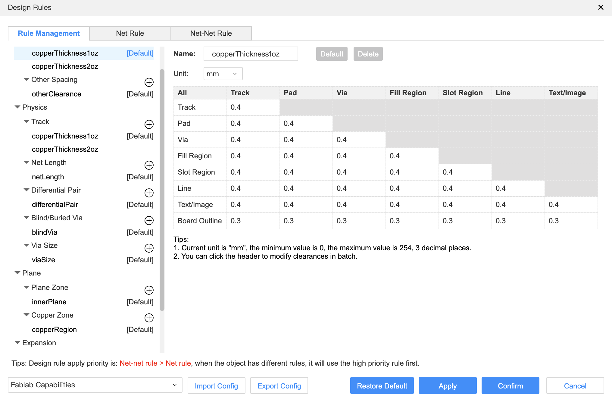

### Export Cutting Images

Export traces, holes and outline black and white images with the same size with PDF. 

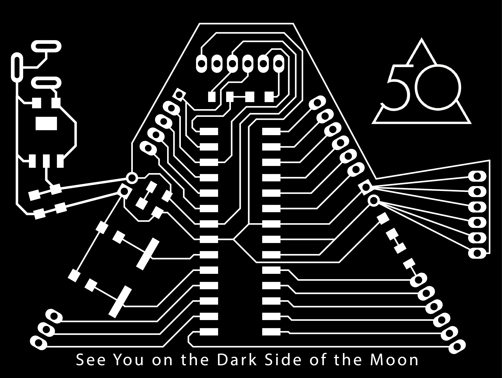

### Export Cutting Files

We use the program in [mods CE](https://modsproject.org/) to export cutting files.

1. Firstly, we need to choose the right program for our CNC machine.

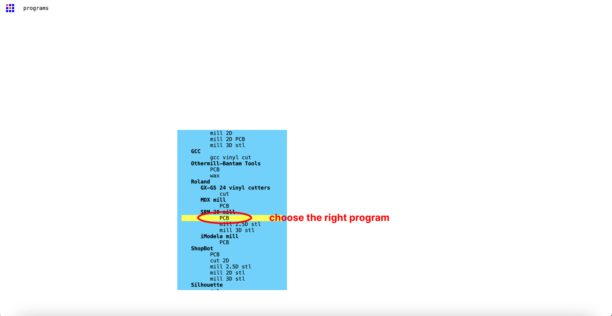

2. Secondly, we need to change some values to cut the traces.

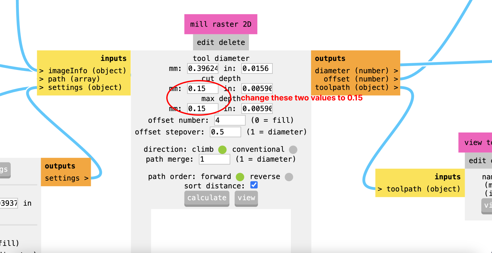

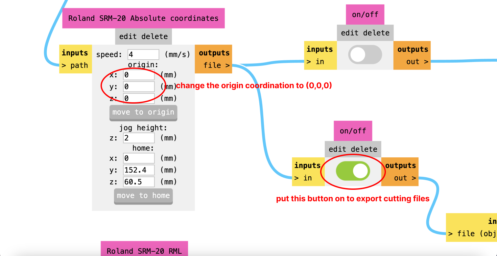

3. Finally, we need to change 0.8mm drill and change some values to cut holes and outline.

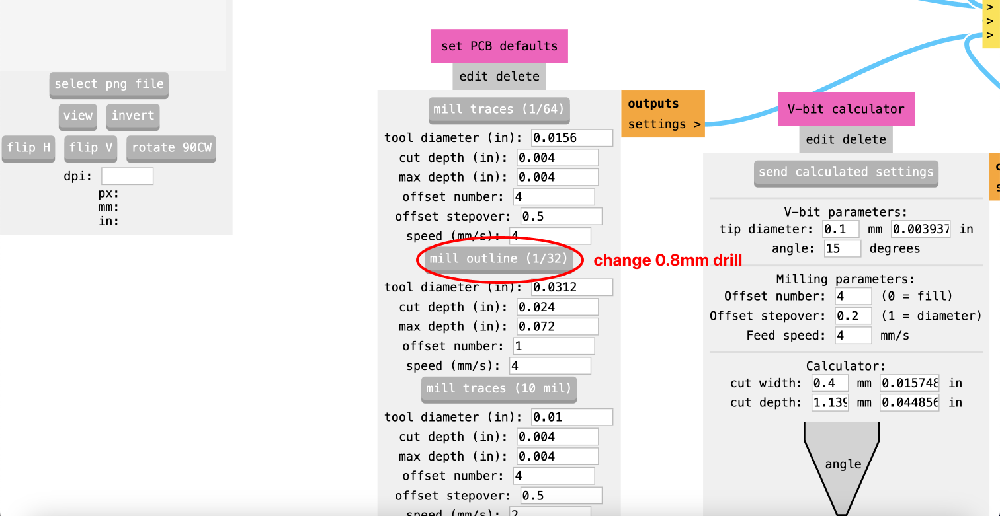

## Output

1.cutting

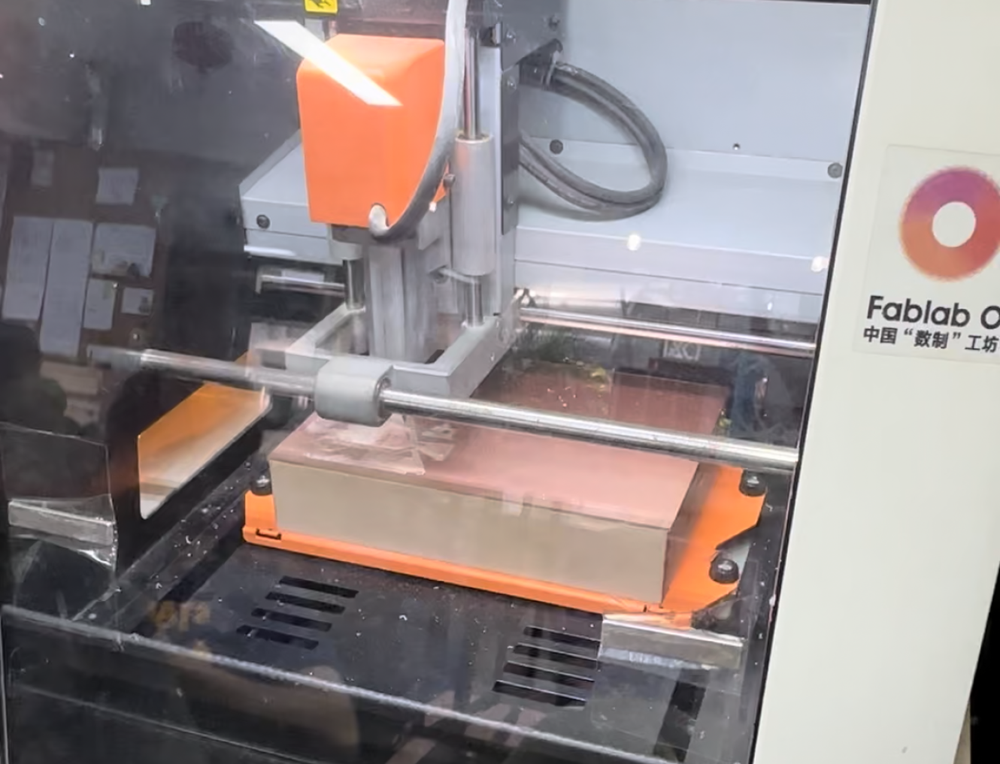

2.prototype after cutting

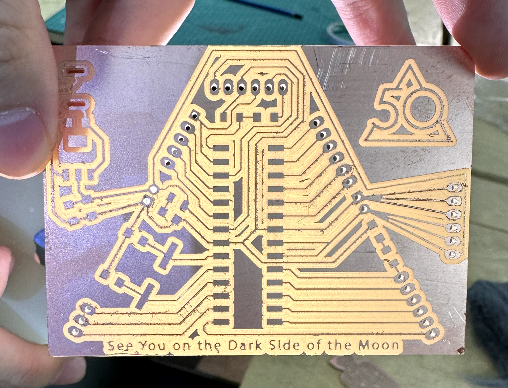

3.polish and solder

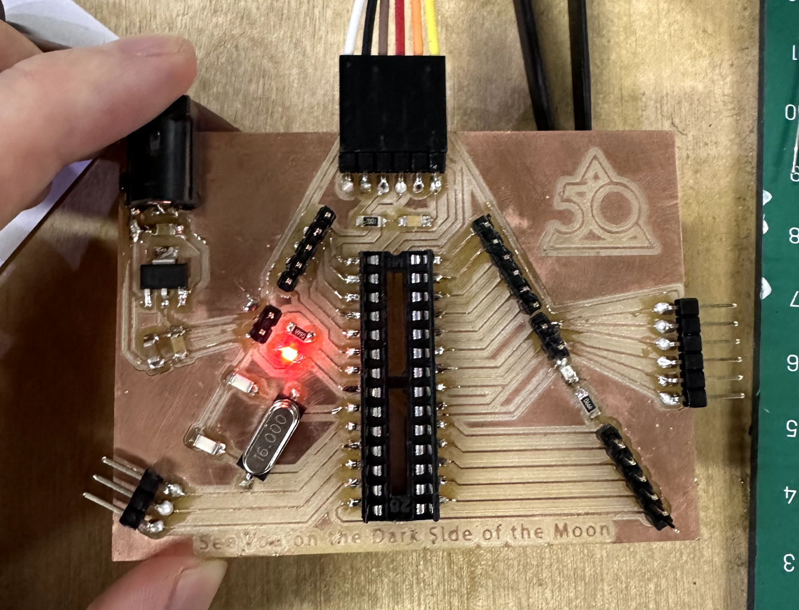
