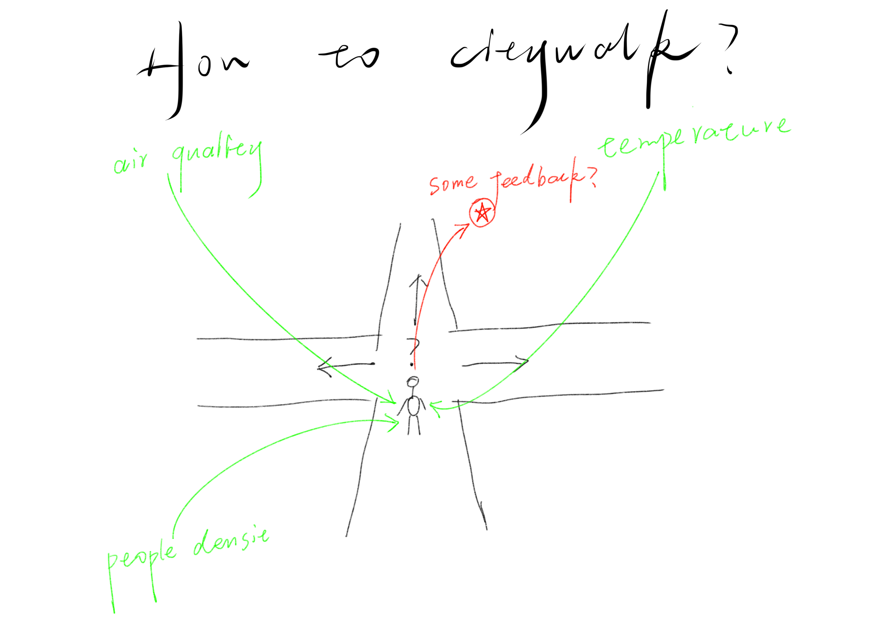
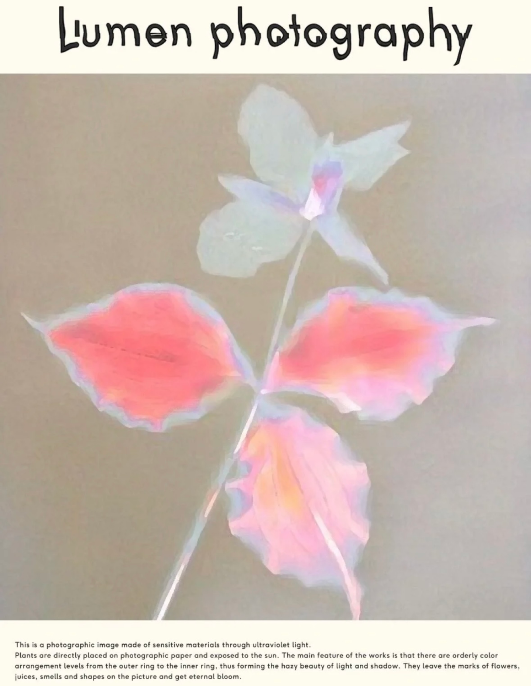

# Nature Explore and Actuators

In this week class, we spent some time exploring nature in a forest park and tried some actuators using our own PCB.

## Forest Park Exploration Record
This week we went to a forest park and spent some time involving ourselves in the nature. During this process, we used our different senses to sense the nature and captured some pheonamenon interesting, which could give us some ideas and be potential to create something helping reducing the distance betweeen citizens and city nature. The following is what I have felt and thought in this exploration.

**My draft in this exploration:** 

### 1. Using Medium to Create a Sense of Immersion

#### My Feelings:

 

It's easy to find that people in this park immerse greatly themselves in nature, they are playing Taichi, flying kites, playing instruments and so on. There is a good balance and harmony between them and nature, which is rare in other busy part of the city just like our school. So, the key to their immersion is all of them have a type of **tool or medium**(Taichi,kite,music...) to integrate into nature. So maybe we can also create a medium to help create a sense of immersion.

#### An Interesting Cases:

[Pokemon Go](https://pokemongolive.com/?hl=en) : It's an AR mobile game encourage people to go to real world to capture virtual pokemon, which is a good example that uses medium to build a better bond between human and nature.

#### My Idea:

 

This make me think about "citywalk", which is a popular activity this year. In my opinion, the route of citywalk have a great influence in the whole experience. So, maybe we can use PCB to create something help us choose route to get a good experience rather than random walking. We can use different sensors(maybe light, air quality, GPS...) to guide us to a better environment and use actuators to give us some feedback to create something interesting to help us immersed. The entity of this PCB could be wearable devices, toys(just like kite?) and so on.

### 2. Sunshine Art

#### My Feelings:

 

When I was takeing notes under some trees, I found that sunshine cast beautiful shadow on my paper. It gave me a feeling that maybe sunshine and other natural things can collaborate to be a natural artist.

#### Something Interesting : Lumen Print

 

#### My Idea:

I want to design a natural recorder, which could allow the sunshine and falling natural things(leaves, flowers, and anything natural) to create some art by themselves with the tech of lumen print.
