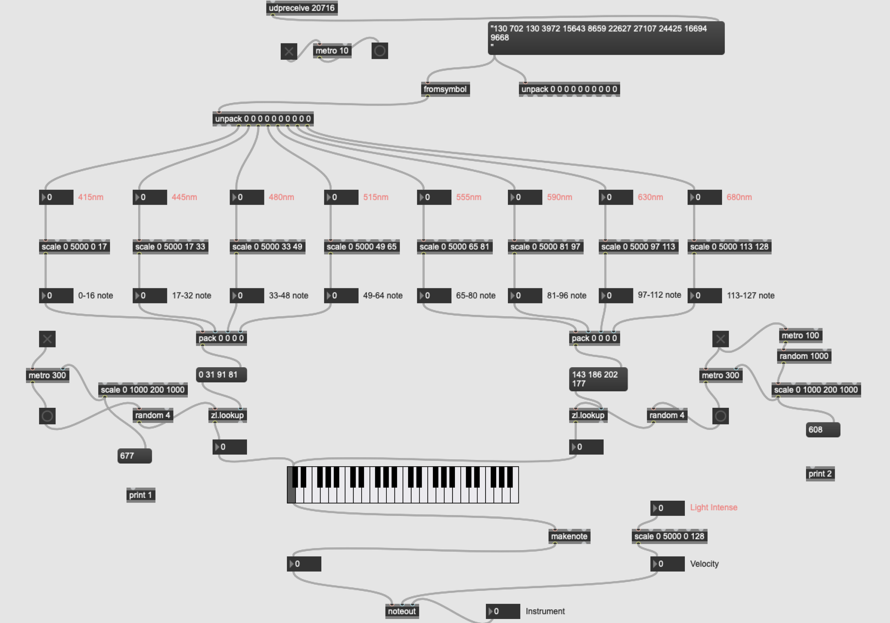

# SunMelodino

## Inspiration

It was a coincidence that when I was taking notes, the sun and shadow was projected on my paper through the needles, which was producing a beautiful melody under the gentle touch of the breeze.

 

## Research

### Something about sunshine

 

### Something about shadow

 

## Ideation

A brief introduction to my design ideation.

 

## Design

### PCB Design

#### Schematic

 

#### PCB 2D

This year happens to be the 50th anniversary of the legendary album “the Dark Side of the Moon”, which was created by Pink Floyd.  So I choose to design my PCB using classic triangle to explore the relashionship between light and music.

 

### Fabrication

 

### Explosion Map

 

### Max Music Generation

 

## Final Presentation

### Stationary Placement

We can put the device still in nature to capture the rhythm of nature.

 

 

